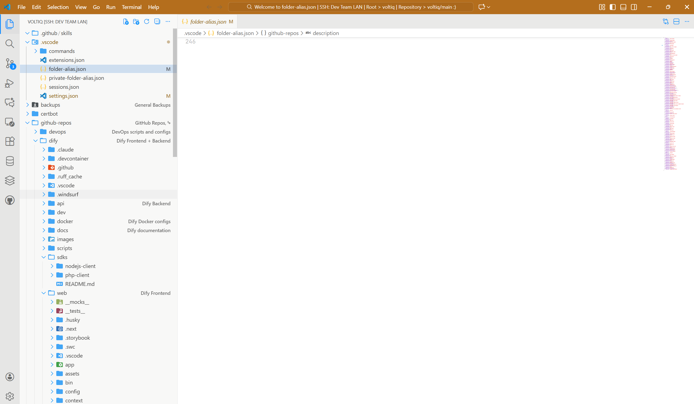

# Folder Alias Enhanced

Easily add custom alias labels to folders and files in VS Code for better project organization. Now with enhanced features and active maintenance.



## Features

-   Custom alias labels for folders/files
-   Right-click context menu integration
-   Public & private alias configs
-   Multi-root workspace support
-   Settings to enable/disable features

## What’s Different?

-   Active maintenance & bug fixes
-   Improved tooltips & performance

## Install

-   Search "Folder Alias Enhanced" in VS Code Extensions and install
-   Or: Download `.vsix` and install via Command Palette > Extensions: Install from VSIX

## Usage

Right-click any folder or file in the Explorer, select **Add Alias**, enter your alias, and press Enter. To remove, clear the input and save.

## Config

Aliases are stored in `.vscode/folder-alias.json` (public) and `.vscode/private-folder-alias.json` (private, git-ignored). Example:

```json
{
    "src/components": { "description": "Components" }
}
```

## License

[GPL-3.0](LICENSE) © All contributors

## Credits

-   Original: [Muromi-Rikka/folder-alias](https://github.com/Muromi-Rikka/folder-alias)
-   Fork: [Peaceful-World-X/folder-alias-fixed](https://github.com/Peaceful-World-X/folder-alias-fixed)
